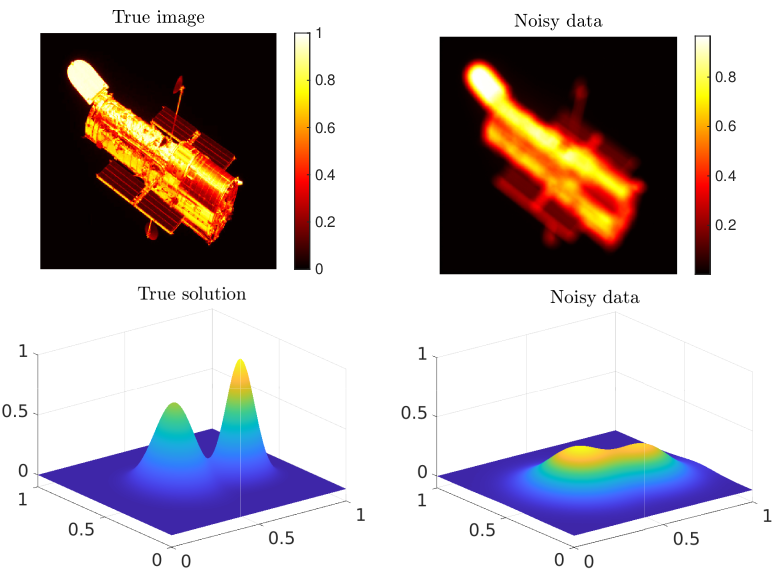

# InverProb_IterSolver

* InverProb_IterSolver is a MATLAB code library for solving linear inverse problems with regularization.
The main goal is to provide subspace projection based iterative methods than can solve
large-scale discrete linear inverse problems with regularization

$$\min_{x\in\mathbb{R}^{n}}\{\|Ax-b\|_{2}^{2}+\lambda R(x)\},$$

where $R(x)$ is the regularizer. It can be either a linear Tikhonov regularization term or  a nonlinear regularization term such as $L_p$ or TV regularization.

## Code Structure
* /Examples. It includes some test examples of 1D small-scale and 2D large-scale inverse problems to test the iterative regularization methods.
* /figs. Some useful figures.
* /Test data. It includes some test data such as 2D images used for running test examples.
* /src. The source codes. 
    1. /Extra. Some auxiliary codes used for running the text example codes.
    2. /Iterative solver. The main iterative regularization algorithm codes.
    3. /Matrix tools. Some auxiliary codes for matrix computations, such as matrix-vector-product when the matrix is a functional handle, or basic decompositions such as QR, Square Root and GSVD.
    4. /Regularization functions. Some codes should be used for running the iterative regularization algorithms, such as WGCV or L-curve methods.

## Notice
At this stage, this code should be used with the following two famous Inverse Problems solver packages:

[1]. P. C. Hansen, Regularization Tools version 4.0 for Matlab 7.3, Numer. Algor., 46 (2007), pp. 189-194.

[2]. S. Gazzola, P. C. Hansen, and J. G. Nagy, IR Tools: A MATLAB package of iterative regularization methods and large-scale test problems, Numer. Algor., 81 (2019), pp. 773-811.

## Submit an issue
You are welcome to submit an issue for any questions related to InverProb_IterSolver. 

## Here are some research papers using InverProb_IterSolver
1. Haibo Li. "[A preconditioned Krylov subspace method for linear inverse problems with general-form Tikhonov regularization](https://arxiv.org/pdf/xx.pdf)."

## License
If you use this code in any future publications, please cite this:

Haibo Li. "[A preconditioned Krylov subspace method for linear inverse problems with general-form Tikhonov regularization](https://arxiv.org/pdf/xx.pdf)."
